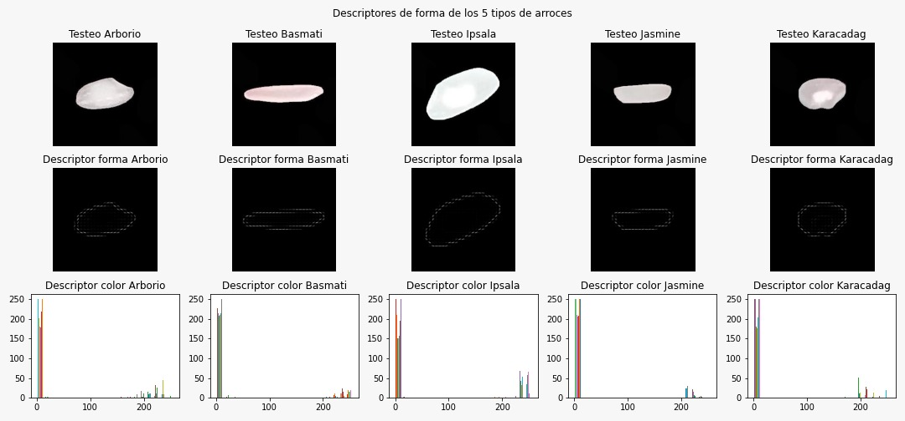
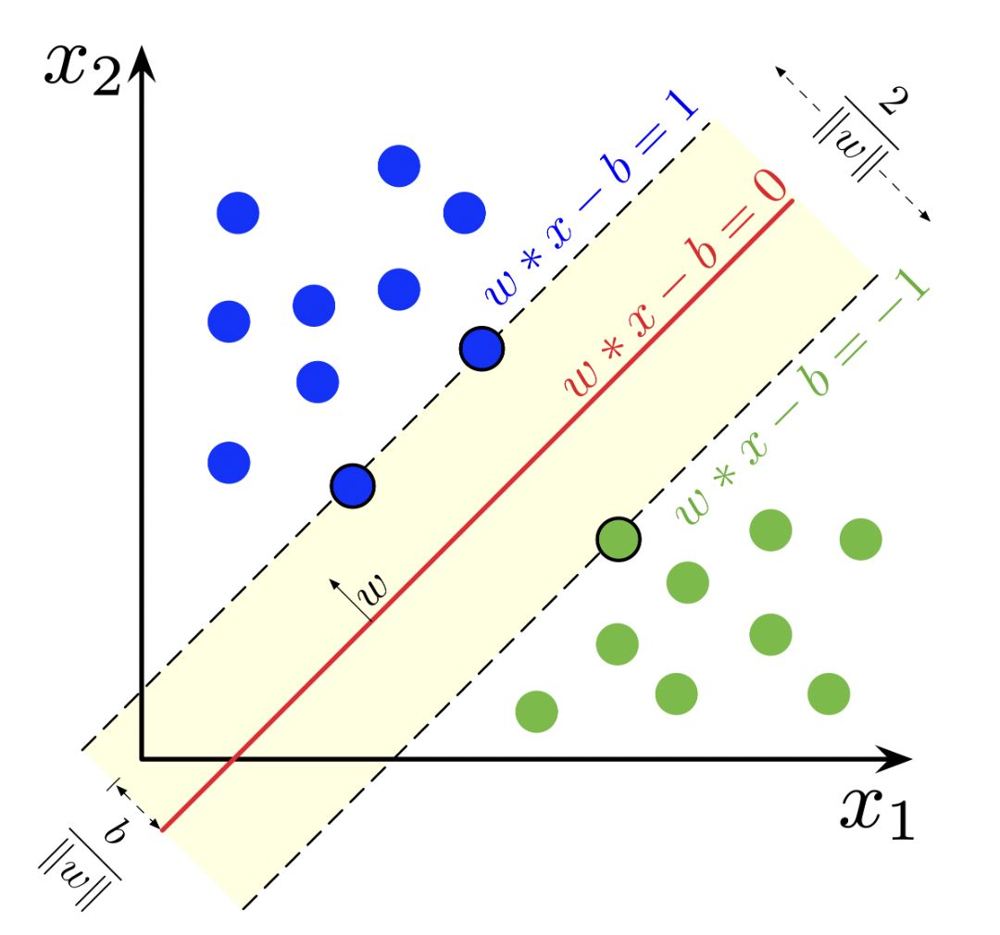

# Reto de clasificación

Para solucionar el reto propuesto de clasificación de 5 tipos diferentes de arroz se hizo uso de las caracteristicas de color y de forma que presentan cada una de las imagenes de la base de datos. Para extraer estas caracteristicas se hizo uso de descriptores de color mediante descriptores concatenados de intensidad y de descriptores de forma mediante el histograma de gradientes orientados HOG. Los descriptores de color se encargan de extraer los valores de intensidad que tiene cada pixel y representa este conjunto de valores mediante el uso de histogramas. 

  

Adicionalmente, para la clasificación y predicción de estos datos se empleó un clasificador basado en Supporting Vector Machines, el cual se encarga de construir un hiperplano que permite hacer una separación de los datos en clases para posteriormente realizar la predicción adecuada. Una caracteristica fundamental es que este tipo de clasificador es plenamente binaria, por lo cual se requiere de entrenar varios modelos para hacer una clasificación 1 vs 1 o 1 vs todos. 

  

Para el correcto funcionamiento de la solución planteada se desarrollaron funciones adicionales las cuales se encuentran en el archivo Model.py, donde cada una de estas cumple un rol especifico. Adicionalmente, se adjuntaron 2 archivos .json adicionales, los cuales contienen:

	1) el modelo de Supporting Vector Machine entrenado
	
	2) los descriptores finales de las imágenes de testeo. Esto con el objetivo de reducir el coste y tiempo computacional a la hora de probar el algoritmo. 

Para el funcionamiento del modelo es necesario contar con las siguientes librerías, las cuales, en caso de no tener se recomienda instalarlas mediante la terminal haciendo uso del comando pip Install 

	•	CV2		pip install opencv-python
	•	Skelarn		pip install -U scikit-learn
	•	Os		pip install os.path2
	•	Argparse	pip install argparse
	•	Pickle		pip install pickle5
	•	Numpy		pip install numpy
	•	Skimage		pip install scikit-image

Por otro lado, para correr el código presente en el archivo eval.py se recomienda hacer uso de la terminal. Este código cumple con dos funciones, uno para la visualización de las métricas de clasificación obtenidas sobre el conjunto de testeo y otra para realizar la predicción de una imagen de interés. Para el funcionamiento de cada una se hacen las siguientes sugerencias: 

	•	Métricas generales:  Hacer uso del comando python eval.py y seguir las indicaciones que van apareciendo cuando se hace la ejecución. 
	
	•	Evaluación individual:  Hacer uso del comando python eval.py --image “nombre”
		En este caso, el nombre que se ingresa es el de la imagen de interés sobre el conjunto de testeo del modelo. 
		Este nombre debe ser fiel a cómo se encuentra guardado e ir entre comillas, por ejemplo, “Karacadag (10864).jpg”.
						      

Finalmente, es fundamental que la base de datos se encuentre a la misma altura del archivo eval.py y de Model.py para que funcione adecuadamente la importación de las imagenes. 

[README.txt](https://github.com/Rafther0112/Reto-de-clasificaci-n-/files/8887933/README.txt)

